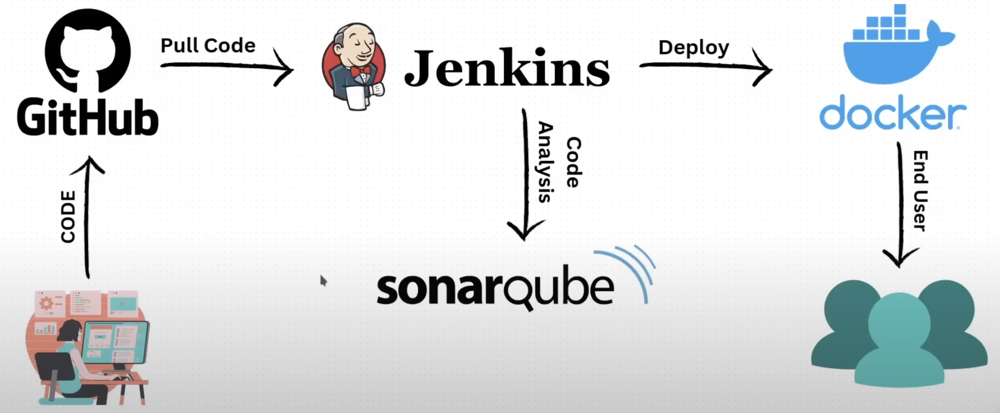

Jenkins CI/CD using Github, Sonarqube, and Docker on an AWS EC2 instance

#### Useful Links
- [Install SonarQube on Ubuntu](https://docs.vultr.com/how-to-use-sonarqube-on-ubuntu-22-04-lts)
- [Installing Docker on Ubuntu](https://docs.docker.com/engine/install/ubuntu/)
